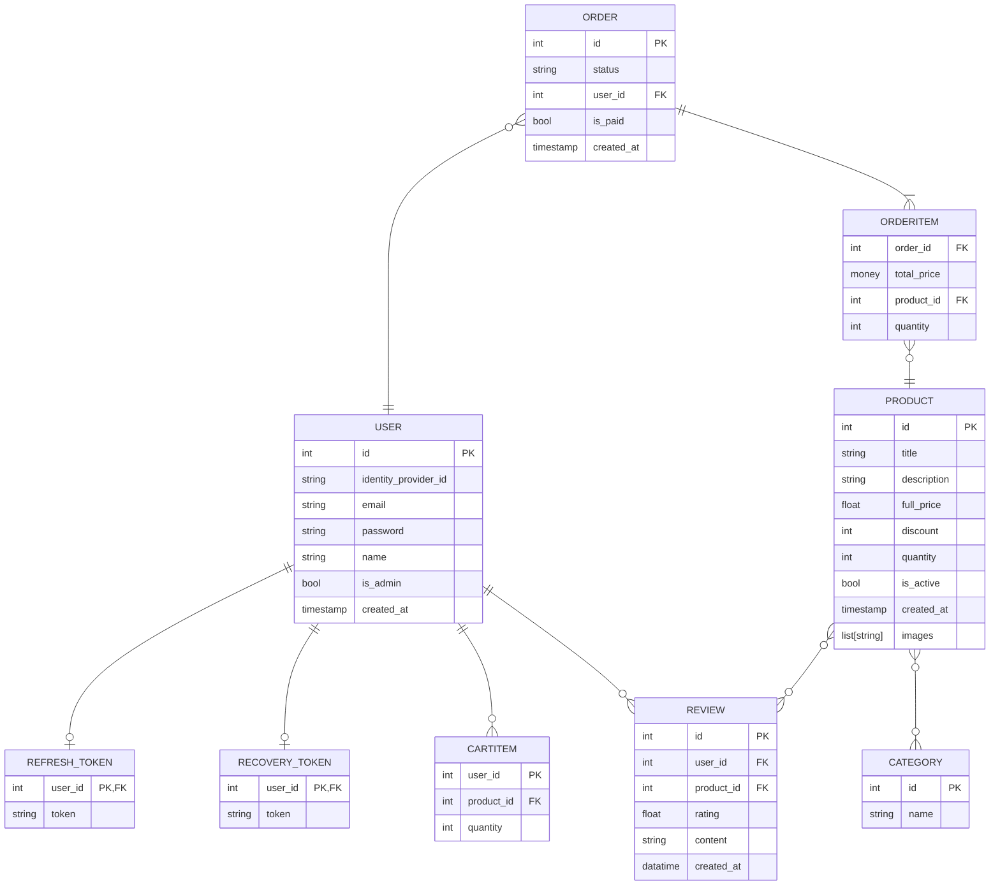

```mermaid
erDiagram
    PRODUCT {
        int id PK
        string title
        string description
        float full_price
        int discount
        int quantity
        bool is_active
        timestamp created_at
        list[string] images
    }

    USER {
        int id PK
        string identity_provider_id
        string email
        string password
        string name
        bool is_admin
        timestamp created_at
    }

    CATEGORY {
        int id PK
        string name
    }

    CARTITEM {
        int user_id PK
        int product_id FK
        int quantity
    }

    ORDER {
        int id PK
        string status
        int user_id FK
        bool is_paid
        timestamp created_at
    }

    REFRESH_TOKEN {
        int user_id PK, FK
        string token
    }

    RECOVERY_TOKEN {
        int user_id PK, FK
        string token
    }

    ORDERITEM {
        int order_id FK
        money total_price
        int product_id FK
        int quantity
    }

    REVIEW {
        int id PK
        int user_id FK
        int product_id FK
        float rating
        string content
        datatime created_at
    }

    PRODUCT }o--o{ CATEGORY: ""
    ORDER }o--|| USER: ""
    ORDER ||--|{ ORDERITEM: ""
    ORDERITEM }o--|| PRODUCT: ""
    USER ||--o| REFRESH_TOKEN: ""
    USER ||--o| RECOVERY_TOKEN: ""
    USER ||--o{ CARTITEM: ""
    USER ||--o{ REVIEW: ""
    PRODUCT }o--o{ REVIEW: ""
```