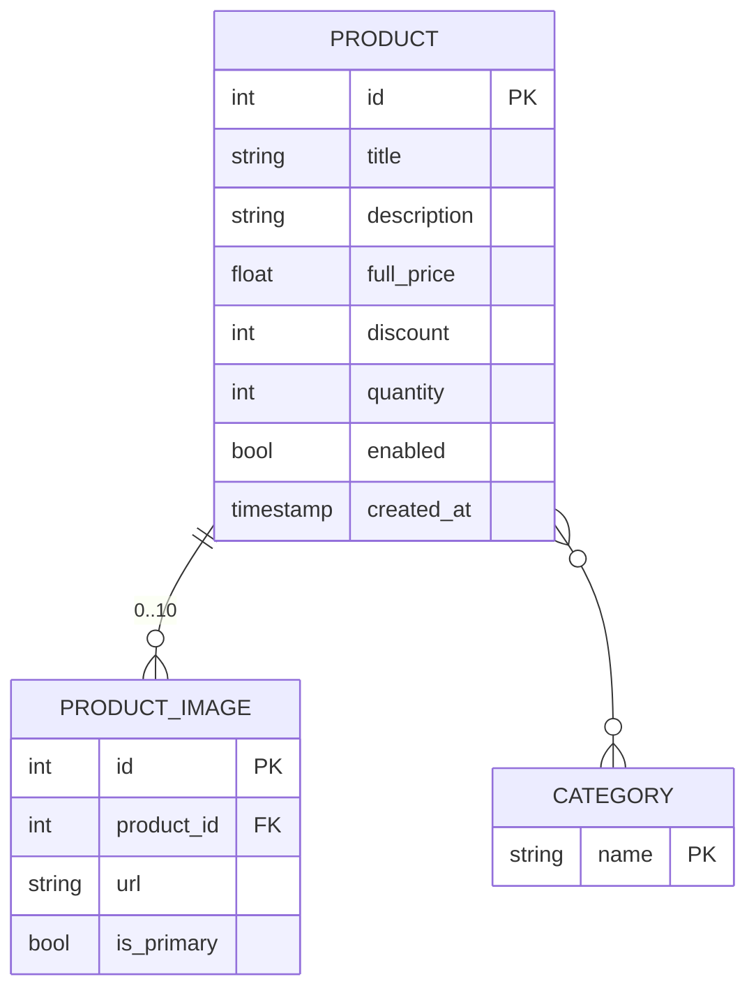

```mermaid
erDiagram
    PRODUCT {
        int id PK
        string title
        string description
        float full_price
        int discount
        int quantity
        bool enabled
        timestamp created_at
    }

    PRODUCT_IMAGE {
        int id PK
        int product_id FK
        string url
        bool is_primary
    }
    
    CATEGORY {
        string name PK
    }

    PRODUCT ||--o{ PRODUCT_IMAGE: "0..10"
    PRODUCT }o--o{ CATEGORY: ""
```